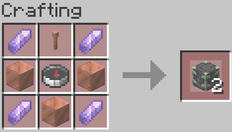

# PortalTeleport

A Minecraft Spigot/Paper plugin that adds craftable paired teleport blocks. Place two blocks from the same pair anywhere in your world and right-click to instantly teleport between them.

## Features

- **Paired Teleport Blocks** - Craft blocks in pairs that link to each other
- **Visual Identification** - Floating holograms show pair ID, block label (α/β), and connection status
- **Custom Naming** - Attach a sign to name each teleport block (e.g., "Home", "Mine")
- **Colored Particles** - Each pair has unique colored particles based on its ID
- **Item Protection** - If a teleport block item is destroyed (lava, fire, despawn), its placed pair is also destroyed with a server-wide announcement
- **Explosion Safe** - Blocks drop as items when destroyed by explosions
- **Piston Proof** - Teleport blocks cannot be pushed or pulled by pistons

## Recipe

Craft two teleport blocks at once using:



- 1 Lightning Rod (top center)
- 1 Compass (center)
- 3 Copper Blocks (left, right, and bottom of compass)
- 4 Amethyst Shards (corners)

## Installation

1. Download the latest `PortalTeleport-1.0.0.jar` from the [Releases](../../releases) page
2. Place the JAR file in your server's `plugins` folder
3. Restart your server
4. (Optional) Edit `plugins/PortalTeleport/config.yml` to customize settings

## Requirements

- Minecraft 1.20.4+
- Spigot or Paper server
- Java 17+

## Usage

1. Craft a pair of teleport blocks using the recipe above
2. Place the first block anywhere in the world
3. Place the second block at your destination
4. Right-click either block to teleport to the other

### Hologram Indicators

Each placed teleport block displays a floating hologram:
- **Pair ID** - Unique identifier (e.g., `TP-f6e542e9`)
- **Label** - `α` for first placed, `β` for second placed
- **Status** - Green `●` = paired and ready, Red `○` = waiting for pair

### Custom Naming with Signs

You can give each teleport block a custom name by attaching a sign:

1. Hold any sign type in your hand (**Important:** Don't be holding a sign while running from a creeper when you want to teleport!)
2. Right-click directly on the teleport block to place the sign
3. Write your desired name on the sign (all lines are combined)
4. The hologram will update to show your custom name instead of the pair ID

Supported sign types:
- Wall signs (attached to the side)
- Standing signs (on top)
- Hanging signs (below the block)
- Wall hanging signs (attached to the side)

Each block in a pair can have its own name - for example, name one "Home" and the other "Mine". Remove the sign to revert to the default pair ID display.

## Configuration

Edit `plugins/PortalTeleport/config.yml`:

```yaml
# Show destination coordinates in the hologram above paired teleport blocks
show-destination-coords: false
```

## Commands

| Command | Description | Permission |
|---------|-------------|------------|
| `/portalteleport` | Show help | - |
| `/portalteleport cleanup` | Remove invalid teleport blocks | `portalteleport.admin` |
| `/portalteleport cleanholograms` | Remove orphaned hologram entities | `portalteleport.admin` |
| `/portalteleport reload` | Reload configuration | `portalteleport.admin` |

## Permissions

| Permission | Description | Default |
|------------|-------------|---------|
| `portalteleport.use` | Use teleport blocks | Everyone |
| `portalteleport.create` | Create teleport blocks | Everyone |
| `portalteleport.admin` | Admin commands | OP |

## Building from Source

```bash
git clone https://github.com/yourusername/portal-teleport.git
cd portal-teleport
mvn clean package
```

The compiled JAR will be in `target/PortalTeleport-1.0.0.jar`

## License

MIT License

## Author

Xerciz
